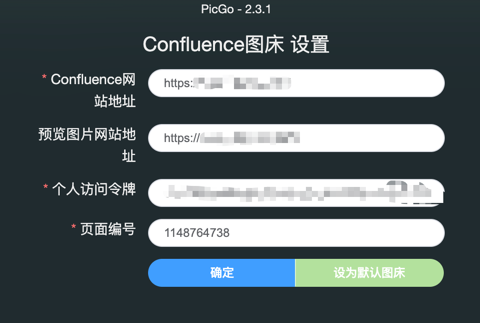

# picgo-plugin-confluence
支持上传到Confluence图库
PicGo Uploader For confluence

### Install

```bash
npm i picgo-plugin-confluencev2
```

### Usage
配置项：
- Confluence网站地址
- 预览图片网站地址
- 个人访问令牌
- 页面编号

参考 [Using Personal Access Tokens](https://confluence.atlassian.com/enterprise/using-personal-access-tokens-1026032365.html) 设置个人访问令牌。一般 Confluence 添加的图片都是需要登陆验证才能访问，导致PicGo上传后无法预览图片，这里提供一种解决方案，自己部署 nginx 反向代理进行访问，将 Confluence 的持久化 Cookie [Confluence Cookies](https://confluence.atlassian.com/doc/confluence-cookies-160794071.html)传输到原始 Confluence 网站，解决验证问题。

```shell
server {
        listen       80;
        server_name  your.domain;

        location / {
            proxy_pass confluence.domain;
            proxy_set_header Cookie "seraph.confluence=xxx"
        }
    }

```

### 支持功能
- [x] 上传文件至指定的Confluence空间中
- [x] 指定预览图片网站地址

### Demo
#### Config View

#### Upload View


### References
- [PicGo插件开发指南](https://picgo.github.io/PicGo-Core-Doc/zh/dev-guide/cli.html)
- [Using the Confluence REST API to upload an attachment to one or more pages](https://confluence.atlassian.com/confkb/using-the-confluence-rest-api-to-upload-an-attachment-to-one-or-more-pages-1014274390.html)
